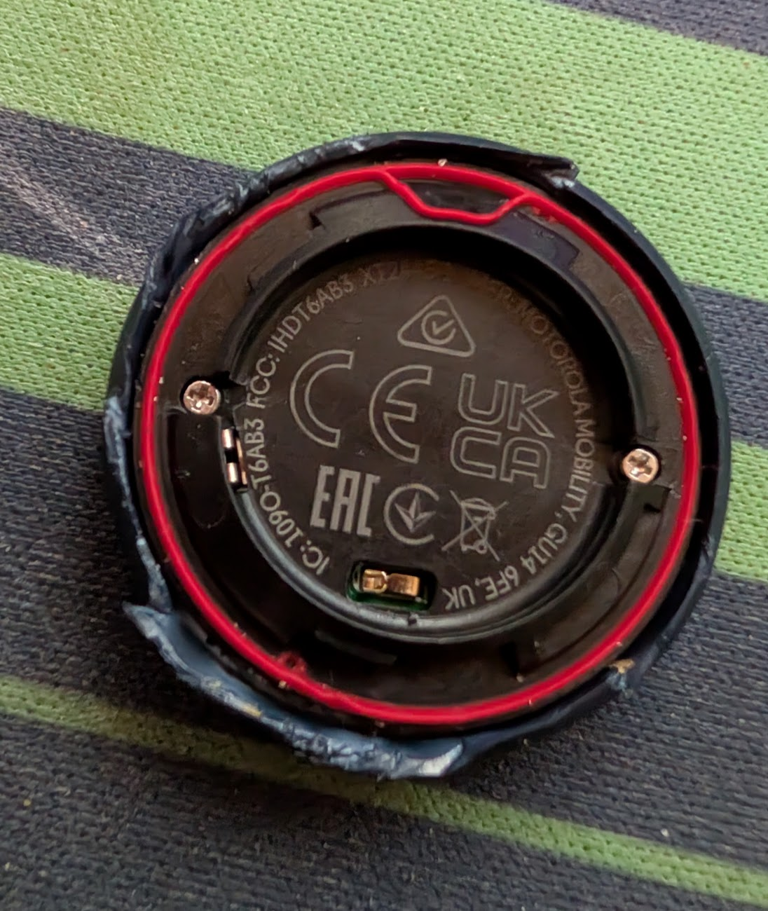
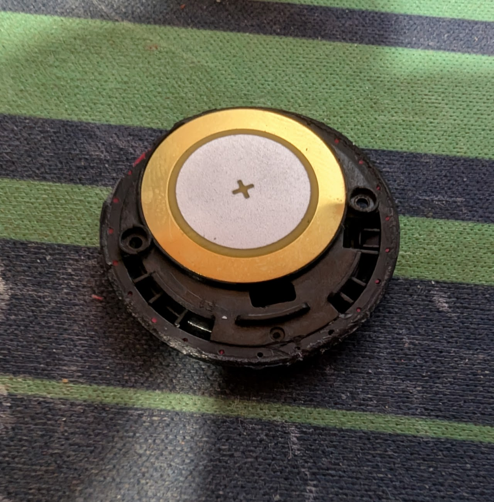

# moto-tag

## Remove the battery cover, battery and remove both visible screws

## "Pry" the edges of the casing to reveal the separation line

After prying enough of the edge, you can use a sharp hobby knife (be careful) to separate the speaker layer as shown in the next picture. It's glued down, but it's soft glue. If you have any trouble, try slightly heating it up with a hair dryer. Be careful with the knife, as below this layer is the PCB uncovered.

## Speaker layer now removed

After this, the PCB can just be taken out:

